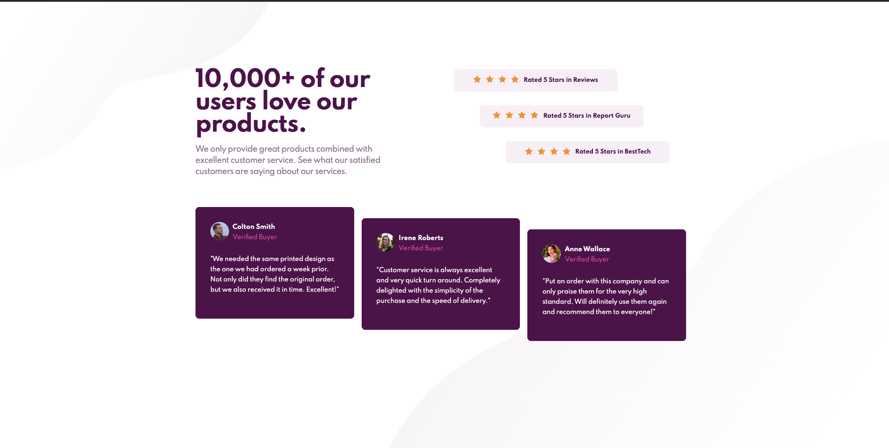

# Frontend Mentor - Social proof section solution

This is a solution to the [Social proof section challenge on Frontend Mentor](https://www.frontendmentor.io/challenges/social-proof-section-6e0qTv_bA). Frontend Mentor challenges help you improve your coding skills by building realistic projects. 

## Table of contents

- [Overview](#overview)
  - [The challenge](#the-challenge)
  - [Screenshot](#screenshot)
  - [Links](#links)
- [My process](#my-process)
  - [Built with](#built-with)
  - [What I learned](#what-i-learned)
  - [Continued development](#continued-development)  
- [Author](#author)


## Overview
I made this project in order to test my layout skills quite a bit. Flexbox and Grid Were def a great challenge.
### The challenge

Users should be able to:

- View the optimal layout for the section depending on their device's screen size

### Screenshot



### Links

- Solution URL: [Add solution URL here](https://your-solution-url.com)
- Live Site URL: [Add live site URL here](https://your-live-site-url.com)

## My process

### Built with

- Semantic HTML5 markup
- CSS custom properties
- Flexbox
- CSS Grid
- Mobile-first workflow
- SASS Preprocessing


### What I learned
On this challenge a learned quite good about Grid CSS, messing around with properties like grid-column-start/end gave me more confidency for future adeavors with css.
To see how you can add code snippets, see below:

```html
  <section class="ratings">
        <div class="ratings__item ratings-a">
          <ul>
            <li></li>
            <li></li>
            <li></li>
            <li></li>
          </ul>
          <p>Rated 5 Stars in Reviews</p>
        </div>
        <div class="ratings__item ratings-b">
          <ul>
            <li></li>
            <li></li>
            <li></li>
            <li></li>
          </ul>
          <p>Rated 5 Stars in Report Guru</p>
        </div>
        <div class="ratings__item ratings-c">
          <ul>
            <li></li>
            <li></li>
            <li></li>
            <li></li>
          </ul>
          <p>Rated 5 Stars in BestTech</p>
        </div>
      </section>
```
```css
.ratings{
      display: grid;
      grid-template-columns: 3rem 3rem 15rem 3rem 3rem ;
      grid-template-rows: repeat(3,1fr);
      gap: .5rem;
      width: 32rem;
      justify-items: unset;
    }
    .ratings__item.ratings-a{
      grid-column-start: 1;
      grid-column-end: 4;
      grid-row-start: 1;
      grid-row-end: 2;
    }
    .ratings__item.ratings-b{
      grid-column-start: 2;
      grid-column-end: 5;
      grid-row-start: 2;
      grid-row-end: 3;
    }
    .ratings__item.ratings-c{
      grid-column-start: 3;
      grid-column-end: 6;
      grid-row-start: 3;
      grid-row-end: last-line;
    }


    .ratings__item{
      display: flex;
      flex-direction: row;
      align-items: center;
      justify-content: center;
      width: auto;
      height: 3rem;
      p{
        margin-top: unset;
      }
    }
```

### Continued development

I want to keep mastering my skills on layouts with flexbox and grid, in the near future i want to get more involved on the animations and all those such cool things css offer us. 

## Author

- Frontend Mentor - [@dserranoi](https://www.frontendmentor.io/profile/dserranoi)